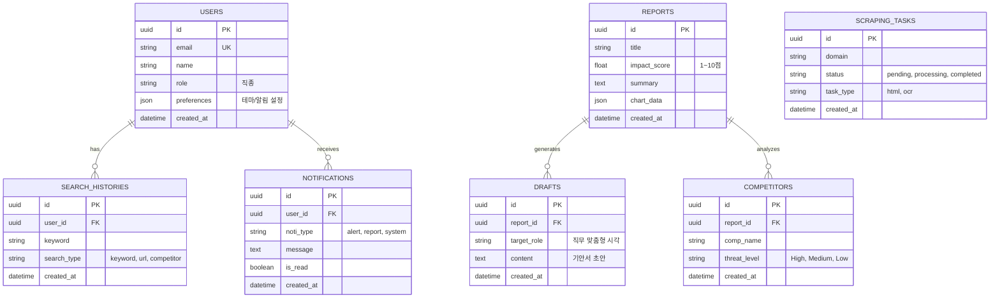

# BizBeacon DB ERD Specification

본 문서는 `API_SPEC.md` 및 `FUNCTIONS.md` 요구사항을 바탕으로 작성된 백엔드 데이터베이스 ERD(Entity-Relationship Diagram) 명세서입니다.

## 1. ERD (Mermaid)

## 2. 테이블 상세 명세

| 테이블명 (Table) | 컬럼명 (Column) | 데이터 타입 (Type) | 필수 (Not Null) | 관계 (Relations) |
| :--- | :--- | :--- | :--- | :--- |
| **USERS** | `id` (PK) `email` `name` `role` `preferences` `created_at` | UUID VARCHAR VARCHAR VARCHAR JSON DATETIME | Y Y Y Y N Y | 1:N with `SEARCH_HISTORIES` 1:N with `NOTIFICATIONS` |
| **SEARCH_HISTORIES** | `id` (PK) `user_id` (FK) `keyword` `search_type` `created_at` | UUID UUID VARCHAR VARCHAR DATETIME | Y Y Y Y Y | Belongs to `USERS` |
| **REPORTS** | `id` (PK) `title` `impact_score` `summary` `chart_data` `created_at` | UUID VARCHAR DECIMAL TEXT JSON DATETIME | Y Y Y Y N Y | 1:N with `DRAFTS` 1:N with `COMPETITORS` |
| **DRAFTS** | `id` (PK) `report_id` (FK) `target_role` `content` `created_at` | UUID UUID VARCHAR TEXT DATETIME | Y Y Y Y Y | Belongs to `REPORTS` |
| **COMPETITORS** | `id` (PK) `report_id` (FK) `comp_name` `threat_level` `created_at` | UUID UUID VARCHAR VARCHAR DATETIME | Y Y Y Y Y | Belongs to `REPORTS` |
| **SCRAPING_TASKS** | `id` (PK) `domain` `status` `task_type` `created_at` | UUID VARCHAR VARCHAR VARCHAR DATETIME | Y Y Y Y Y | (독립 스케줄러 테이블) |
| **NOTIFICATIONS** | `id` (PK) `user_id` (FK) `noti_type` `message` `is_read` `created_at` | UUID UUID VARCHAR TEXT BOOLEAN DATETIME | Y Y Y Y Y Y | Belongs to `USERS` |
